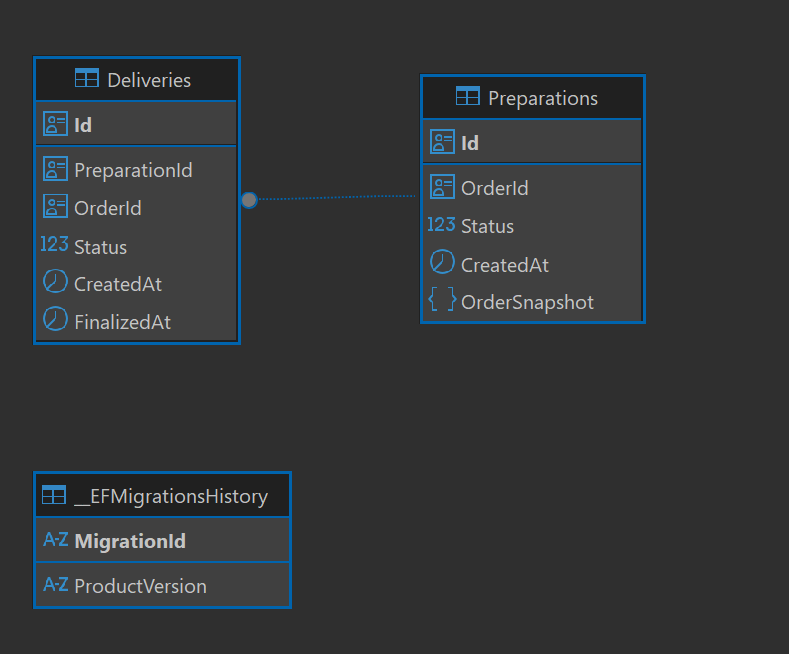
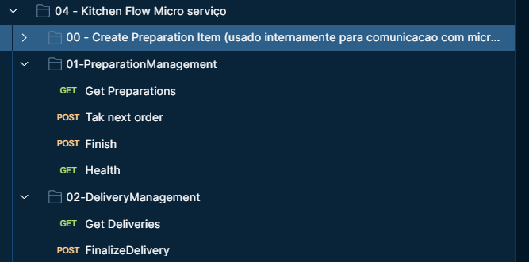

# KitchenFlow API

## Visão Geral do Microsserviço KitchenFlow

O **KitchenFlow** é um microsserviço responsável por operacionalizar o fluxo da cozinha e da entrega no ecossistema FastFood. Ele gerencia os estados operacionais dos pedidos desde a confirmação de pagamento até a finalização da entrega ao cliente.

### Responsabilidades Principais

O KitchenFlow é responsável por:

- **Gerenciamento de Preparações**: Controla o ciclo de vida das preparações dos pedidos, desde o recebimento (após confirmação de pagamento) até a finalização na cozinha
- **Gerenciamento de Entregas**: Administra o processo de entrega dos pedidos prontos, desde a disponibilização para retirada até a finalização da entrega
- **Controle de Estados**: Mantém a integridade e consistência dos estados operacionais (Received → InProgress → Finished para preparações; ReadyForPickup → Finalized para entregas)

### Características Arquiteturais

- **Microsserviço Independente**: O KitchenFlow é implantado e escalado de forma independente, sem compartilhar recursos com outros microsserviços
- **Banco de Dados Exclusivo**: Possui seu próprio banco de dados PostgreSQL (RDS), garantindo isolamento de dados e independência operacional
- **Comunicação Desacoplada**: Integra-se com outros microsserviços (OrderHub e PayStream) via comunicação síncrona HTTP, mantendo baixo acoplamento
- **Deploy Independente**: Pode ser atualizado e implantado sem impactar outros serviços do ecossistema

---

## Banco de Dados – PostgreSQL (RDS)

O KitchenFlow utiliza **PostgreSQL em RDS (Amazon Relational Database Service)** como banco de dados principal para persistência de dados operacionais.

### Entidades Principais

O banco de dados gerencia as seguintes entidades:

- **Preparations (Preparações)**: Armazena informações sobre os pedidos em preparação na cozinha, incluindo status, snapshot do pedido e timestamps operacionais
- **Deliveries (Entregas)**: Gerencia as entregas dos pedidos prontos, mantendo relacionamento com as preparações finalizadas
- **Status Operacionais**: Controla os estados do pedido ao longo do fluxo operacional (Received, InProgress, Finished para preparações; ReadyForPickup, Finalized para entregas)

### Justificativa Arquitetural

A escolha pelo PostgreSQL (RDS) foi fundamentada nos seguintes aspectos arquiteturais:

#### Consistência Forte e Transações ACID

O PostgreSQL oferece garantias de consistência forte e suporte completo a transações ACID, essenciais para o domínio crítico de operações da cozinha. Isso garante que:

- Transições de estado sejam atômicas e consistentes
- Não ocorram perdas de dados durante operações críticas
- A integridade referencial seja mantida entre Preparations e Deliveries

#### Integridade de Estados

O controle de estados operacionais (preparação e entrega) requer garantias de integridade que bancos NoSQL não oferecem nativamente. O modelo relacional permite:

- Validações de estado através de constraints e triggers
- Relacionamentos explícitos entre entidades (Preparations → Deliveries)
- Consultas complexas com garantias de consistência

#### Clareza de Relacionamento entre Entidades

O modelo relacional torna explícito o relacionamento entre Preparations e Deliveries, facilitando:

- Manutenção e evolução do modelo de dados
- Consultas que relacionam preparações e entregas
- Auditoria e rastreabilidade do fluxo operacional

#### Adequação para Controle de Fluxo Operacional

O domínio de cozinha e entrega requer controle preciso de fluxo, onde:

- Cada pedido passa por estados sequenciais bem definidos
- A ordem e timing das operações são críticos
- Consultas por status e relacionamentos são frequentes

### Isolamento e Segurança

**Importante**: Nenhum outro microsserviço acessa o banco de dados do KitchenFlow. O acesso ao RDS é restrito exclusivamente ao serviço KitchenFlow através de:

- Security Groups configurados no AWS RDS
- Princípio de menor privilégio aplicado
- Credenciais gerenciadas via Secrets (não versionadas)

### Modelo de Dados

O diagrama abaixo ilustra o modelo relacional do banco de dados:



O modelo relacional adotado estabelece um relacionamento um-para-muitos entre Preparations e Deliveries, onde uma preparação finalizada pode gerar uma ou mais entregas. As entidades mantêm timestamps operacionais (CreatedAt, FinalizedAt) para auditoria e rastreabilidade do fluxo.

---

## Endpoints Disponíveis

O KitchenFlow expõe endpoints RESTful organizados por contexto funcional:

### Preparation Management

- `POST /api/preparation` - Cria uma nova preparação (chamado internamente pelo PayStream após confirmação de pagamento)
- `GET /api/preparation` - Lista preparações com paginação e filtro opcional por status
- `POST /api/preparation/take-next` - Inicia a preparação mais antiga com status Received (transição para InProgress)
- `POST /api/preparation/{id}/finish` - Finaliza uma preparação (transição para Finished e criação automática de Delivery)

### Delivery Management

- `GET /api/delivery/ready` - Lista entregas prontas para retirada (status ReadyForPickup) com paginação
- `POST /api/delivery/{id}/finalize` - Finaliza uma entrega (transição para Finalized)

### Health Check

- `GET /api/health` - Endpoint de health check para monitoramento

### Documentação Interativa

A imagem abaixo ilustra os principais endpoints expostos pelo KitchenFlow, organizados por contexto funcional:



**Recursos de Documentação:**

- **Swagger UI**: Documentação interativa disponível em `/swagger` (ambiente de desenvolvimento)
- **Postman Collection**: Collection completa disponível em `docs/CollectionTcFase4.json`

A imagem acima mostra a estrutura hierárquica dos endpoints no Postman, evidenciando a organização por módulos funcionais (Preparation Management e Delivery Management).

---

## Arquitetura do Microsserviço

O KitchenFlow segue uma arquitetura de microsserviços independente, com as seguintes características:

### Independência Operacional

- **Deploy Independente**: O serviço pode ser implantado e atualizado sem impactar outros microsserviços
- **Escalabilidade Independente**: Pode ser escalado horizontalmente conforme a demanda operacional
- **Banco de Dados Exclusivo**: Possui seu próprio banco PostgreSQL (RDS), garantindo isolamento completo de dados

### Comunicação com Outros Microsserviços

O KitchenFlow se comunica com outros microsserviços através de:

- **Comunicação Síncrona HTTP**: Integração direta com OrderHub e PayStream via chamadas HTTP RESTful
- **Services Internos do Kubernetes**: Comunicação entre microsserviços ocorre via Services internos (ClusterIP) do Kubernetes, garantindo baixa latência e segurança de rede
- **Contratos Bem Definidos**: Cada integração possui contratos documentados (ver `docs/INTEGRATION_CONTRACT.md`)

### Infraestrutura

- **Orquestração via Kubernetes**: O serviço é implantado e gerenciado em um cluster Kubernetes
- **RDS PostgreSQL**: Banco de dados gerenciado em RDS para alta disponibilidade e backups automáticos
- **CI/CD Pipeline**: Pipeline automatizado via GitHub Actions para build, testes e deploy

### Fluxo de Integração

```
Payment (PayStream) → POST /api/preparation → KitchenFlow cria Preparation (status: Received)
                                                      ↓
KitchenFlow → POST /api/preparation/take-next → Preparation (status: InProgress)
                                                      ↓
KitchenFlow → POST /api/preparation/{id}/finish → Preparation (status: Finished) + Delivery criada (status: ReadyForPickup)
                                                      ↓
KitchenFlow → POST /api/delivery/{id}/finalize → Delivery (status: Finalized)
```

---

## Clean Architecture (Abordagem Pragmática)

O KitchenFlow adota uma **abordagem pragmática de Clean Architecture**, com aproximadamente **70% de aderência** aos princípios clássicos. Esta decisão arquitetural foi tomada conscientemente para equilibrar os benefícios da Clean Architecture com a necessidade de manter o código legível, focado no domínio e sem excesso de abstrações.

### Decisões Arquiteturais

#### O que foi mantido (70% de aderência):

- **UseCases Claros**: Cada operação de negócio é encapsulada em um UseCase específico, facilitando compreensão e manutenção
- **Domínio Isolado**: A camada Domain contém apenas lógica de negócio pura, sem dependências de infraestrutura
- **Infra Desacoplada**: A camada de infraestrutura implementa interfaces definidas na Application, permitindo substituição de implementações
- **Injeção de Dependência**: Dependency Injection concentrada na borda (API), mantendo o código testável e desacoplado

#### O que foi simplificado (30% de flexibilidade):

- **Menos Abstrações**: Evitamos criar interfaces e abstrações desnecessárias quando uma implementação direta é suficiente
- **Foco na Legibilidade**: Priorizamos código legível e direto sobre abstrações teóricas
- **Pragmatismo sobre Pureza**: Mantemos o equilíbrio entre princípios arquiteturais e necessidades práticas do projeto

### Estrutura de Camadas

```
src/
├── Core/
│   ├── FastFood.KitchenFlow.Domain/          # Entidades de domínio, Value Objects, Exceções
│   ├── FastFood.KitchenFlow.Application/     # UseCases, InputModels, Responses, Ports (interfaces)
│   └── FastFood.KitchenFlow.CrossCutting/    # Extensões e utilitários compartilhados
├── Infra/
│   ├── FastFood.KitchenFlow.Infra/          # Implementações de serviços externos
│   └── FastFood.KitchenFlow.Infra.Persistence/  # Repositories, DbContext, Migrations
└── InterfacesExternas/
    ├── FastFood.KitchenFlow.Api/             # Controllers, Program.cs, configurações
    └── FastFood.KitchenFlow.Migrator/        # Job para executar migrations
```

### Princípios Aplicados

- **Separação de Responsabilidades**: Cada camada tem responsabilidades bem definidas
- **Dependency Inversion**: Camadas externas dependem de abstrações definidas nas camadas internas
- **Testabilidade**: Estrutura permite testes unitários e de integração com facilidade
- **Manutenibilidade**: Código organizado facilita evolução e manutenção

Esta abordagem pragmática permite que o projeto mantenha os benefícios da Clean Architecture (testabilidade, manutenibilidade, desacoplamento) sem o overhead de abstrações excessivas que poderiam complicar o desenvolvimento e a compreensão do código.

---

## Qualidade, Testes e BDD

O KitchenFlow mantém um rigoroso processo de garantia de qualidade através de testes automatizados, BDD e análise estática de código.

### Cobertura de Testes

O projeto mantém aproximadamente **80% de cobertura de testes**, garantindo que a maior parte do código crítico esteja protegido por testes automatizados.

#### Tipos de Testes Implementados

- **Testes Unitários**: Cobertura completa de UseCases, Controllers e Repositories
  - Localização: `src/tests/FastFood.KitchenFlow.Tests.Unit/`
  - Frameworks: xUnit, Moq, FluentAssertions
  - Foco: Lógica de negócio, validações e transformações de dados

- **Testes BDD (Behavior Driven Development)**: Validação de fluxos end-to-end críticos
  - Localização: `src/tests/FastFood.KitchenFlow.Tests.Bdd/`
  - Framework: SpecFlow
  - Cenário principal: Fluxo completo de preparação (Payment → Preparation Created → Started → Finished → Delivery Created)

#### Exemplo de Teste BDD

O projeto inclui um teste BDD que valida o fluxo completo de preparação:

```gherkin
Feature: Preparation Flow
  Scenario: Kitchen receives payment confirmation and completes preparation successfully
    Given I have a valid order with ID
    And the order snapshot contains valid order data
    When I create a preparation for this order
    Then the preparation should be created with status "Received"
    When I start the preparation
    Then the preparation should have status "InProgress"
    When I finish the preparation
    Then the preparation should have status "Finished"
    And a delivery should be created for this preparation
```

### Qualidade Garantida por SonarCloud

O projeto utiliza **SonarCloud** para análise estática de código e garantia de qualidade:

- **Quality Gate**: O pipeline CI valida que o Quality Gate do SonarCloud é respeitado antes de permitir merge
- **Análise Automática**: Cada pull request e push para a branch principal dispara análise automática
- **Métricas Monitoradas**:
  - Cobertura de testes (meta: ≥80%)
  - Code smells e bugs
  - Vulnerabilidades de segurança
  - Duplicação de código
  - Complexidade ciclomática

### Pipeline CI/CD

O pipeline de CI/CD valida automaticamente:

1. **Build**: Compilação do projeto e validação de dependências
2. **Testes**: Execução de todos os testes unitários e BDD
3. **Cobertura**: Análise de cobertura de código (via Coverlet)
4. **SonarCloud**: Análise estática e validação do Quality Gate
5. **Deploy**: Deploy automático após validações bem-sucedidas

### Critérios de Aceite

- ✅ **Cobertura mínima**: ≥80% de cobertura de código
- ✅ **Teste BDD**: Pelo menos um fluxo crítico validado via BDD
- ✅ **Quality Gate**: SonarCloud Quality Gate deve passar em todas as análises
- ✅ **Pipeline**: Todas as validações devem passar antes do merge

Esta seção é crítica para avaliação da FIAP, evidenciando o compromisso do projeto com qualidade, testabilidade e manutenibilidade do código.

---

## Segurança e Configurações

O KitchenFlow implementa práticas de segurança e configuração adequadas para um ambiente de produção.

### Gerenciamento de Credenciais

- **Variáveis de Ambiente**: Todas as configurações sensíveis são gerenciadas via variáveis de ambiente
- **Secrets do Kubernetes**: Credenciais de banco de dados e tokens são armazenados em Secrets do Kubernetes
- **Nenhuma Credencial Versionada**: Nenhuma credencial, senha ou token é commitada no repositório

### Acesso ao Banco de Dados

- **Security Groups**: O acesso ao RDS PostgreSQL é controlado via Security Groups da AWS
- **Princípio de Menor Privilégio**: O serviço possui apenas as permissões necessárias para operação
- **Isolamento de Rede**: Comunicação com o banco ocorre apenas através de redes privadas configuradas

### Autenticação e Autorização

- **JWT Bearer Authentication**: Suporte a autenticação via JWT para clientes e administradores
- **Cognito Integration**: Integração com AWS Cognito para autenticação de administradores
- **Policies de Autorização**: Endpoints administrativos protegidos por policies de autorização

### Configurações

As principais configurações do serviço são gerenciadas via:

- **appsettings.json**: Configurações não sensíveis (URLs, timeouts, etc.)
- **Environment Variables**: Configurações específicas por ambiente (desenvolvimento, staging, produção)
- **Kubernetes ConfigMaps**: Configurações compartilhadas entre pods
- **Kubernetes Secrets**: Credenciais e tokens sensíveis

---

## Tecnologias e Ferramentas

### Stack Principal

- **.NET 8**: Framework principal da aplicação
- **ASP.NET Core**: Framework web para APIs RESTful
- **Entity Framework Core**: ORM para acesso ao banco de dados PostgreSQL
- **PostgreSQL (RDS)**: Banco de dados relacional gerenciado na AWS

### Testes

- **xUnit**: Framework de testes unitários
- **Moq**: Framework de mocking para testes isolados
- **FluentAssertions**: Biblioteca para assertions mais legíveis
- **SpecFlow**: Framework para testes BDD
- **Coverlet**: Ferramenta para análise de cobertura de código

### Qualidade e CI/CD

- **SonarCloud**: Análise estática de código e qualidade
- **GitHub Actions**: Pipeline de CI/CD
- **Docker**: Containerização da aplicação
- **Kubernetes**: Orquestração e deploy

---

## Estrutura do Projeto

```
fiap-fase4-kitchenflow-api/
├── src/
│   ├── Core/                           # Camadas de negócio
│   │   ├── FastFood.KitchenFlow.Domain/
│   │   ├── FastFood.KitchenFlow.Application/
│   │   └── FastFood.KitchenFlow.CrossCutting/
│   ├── Infra/                          # Camadas de infraestrutura
│   │   ├── FastFood.KitchenFlow.Infra/
│   │   └── FastFood.KitchenFlow.Infra.Persistence/
│   ├── InterfacesExternas/             # APIs e interfaces externas
│   │   ├── FastFood.KitchenFlow.Api/
│   │   └── FastFood.KitchenFlow.Migrator/
│   └── tests/                          # Testes automatizados
│       ├── FastFood.KitchenFlow.Tests.Unit/
│       └── FastFood.KitchenFlow.Tests.Bdd/
├── docs/                                # Documentação
│   ├── CollectionTcFase4.json         # Postman Collection
│   ├── dbKitchenFlow.png               # Diagrama ER
│   ├── fluxoCozinha.png                # Fluxo de endpoints
│   └── INTEGRATION_CONTRACT.md         # Contrato de integração
├── rules/                               # Regras e contexto do projeto
├── story/                               # Histórias técnicas
└── README.md                            # Este arquivo
```

---

## Como Executar

### Pré-requisitos

- .NET 8 SDK
- PostgreSQL (ou acesso a um banco RDS)
- Docker (opcional, para execução via containers)

### Configuração Local

1. Clone o repositório
2. Configure a connection string do PostgreSQL em `appsettings.json` ou via variáveis de ambiente
3. Execute as migrations:
   ```bash
   dotnet run --project src/InterfacesExternas/FastFood.KitchenFlow.Migrator
   ```
4. Execute a API:
   ```bash
   dotnet run --project src/InterfacesExternas/FastFood.KitchenFlow.Api
   ```

### Executar Testes

```bash
# Testes unitários
dotnet test src/tests/FastFood.KitchenFlow.Tests.Unit/

# Testes BDD
dotnet test src/tests/FastFood.KitchenFlow.Tests.Bdd/

# Todos os testes com cobertura
dotnet test /p:CollectCoverage=true /p:CoverletOutputFormat=opencover
```

---

## Documentação Adicional

- **Contrato de Integração**: `docs/INTEGRATION_CONTRACT.md` - Documentação detalhada da integração com PayStream
- **Postman Collection**: `docs/CollectionTcFase4.json` - Collection completa para testes de API
- **Diagrama de Arquitetura**: `docs/PosTech-TechChallengerFase4.png` - Visão geral da arquitetura do sistema

---

## Contribuindo

Este projeto faz parte do Tech Challenge – Fase 4 da Pós Tech (Arquitetura de Microsserviços) da FIAP. Para contribuições, siga os padrões estabelecidos e garanta que todos os testes passem antes de submeter pull requests.

---

## Licença

Este projeto é parte do Tech Challenge da FIAP e é destinado exclusivamente para fins educacionais.
